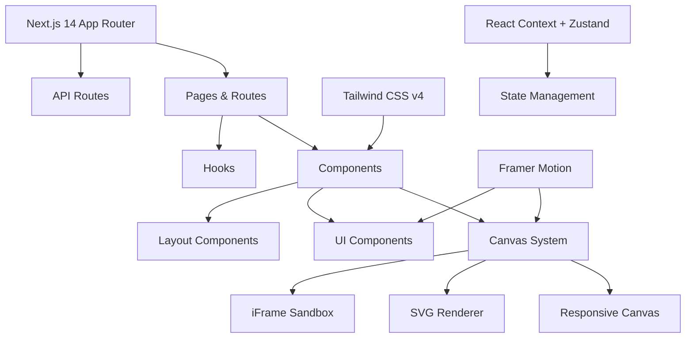

<div align="center">
  
# RIVAL - AI Model Comparisons


### _Witness leading AI models compete in real-time, one prompt at a time_

[](https://nextjs.org/)
[](https://tailwindcss.com/)
[](https://www.framer.com/motion/)
[](https://www.typescriptlang.org/)
[](https://rival.tips)

</div>

## 📋 Table of Contents
- [Overview](#-overview)
- [Key Features](#-key-features)
- [Getting Started](#-getting-started)
- [Tech Architecture](#-tech-architecture)
- [Contributing](#-contributing)
- [License](#-license)
- [Acknowledgements](#-acknowledgements)

## ✨ Overview

**RIVAL** is an immersive platform where leading AI models face off in head-to-head competitions. Compare how Claude Sonnet 3.7, GPT-4.5, Grok 3 Thinking, DeepSeek R1, Gemini 2.0, and other top language models tackle identical one-shot prompts across various tasks including coding, creative writing, SVG generation, and problem-solving.

<table>
<tr>
<td>

### 🔥 Experience
- **Direct comparisons** of how different AI models solve the same problems
- **One-shot responses** showing raw, unfiltered AI capabilities
- **Interactive exploration** of 25+ diverse prompt challenges
- **Comprehensive insights** into each model's strengths and limitations

</td>
<td>

### 🧠 AI Models
- GPT-4.5, GPT-4o, GPT-o3-mini, GPT-o1
- Claude Sonnet 3.7 Thinking, Claude Sonnet 3.7, Claude Sonnet 3.6 (2022-10-22)
- Grok 3 & Grok 3 Thinking
- Gemini 2.0 Pro, Gemini 2.0 Flash Thinking
- DeepSeek R1

</td>
</tr>
</table>

<div align="center">

<p><em>Side-by-side model comparisons showing how different AI models approach identical challenges</em></p>
</div>

## 🎮 Key Features

<table>
<tr>
<td width="50%">
<h3>📊 Interactive Model Comparison</h3>
<p>Select any two AI models and compare their responses side-by-side across all challenge categories. Easily filter and search through different challenges to find exactly what you're looking for.</p>

</td>
<td width="50%">
<h3>🔍 Expandable Response Canvas</h3>
<p>Examine AI outputs in detail with our responsive canvas system. Each response can be expanded to get a closer look at code, images, websites, and more, allowing for detailed analysis of model capabilities.</p>

</td>
</tr>
<tr>
<td width="50%">
<h3>🏆 Curated Challenge Gallery</h3>
<p>Explore our collection of 25+ challenging prompts specifically designed to push AI capabilities to their limits, organized by category and difficulty level.</p>

</td>
<td width="50%">
<h3>🎨 Rich Output Visualization</h3>
<p>View SVG designs, interactive websites, styled code, markdown, and raw text outputs rendered beautifully in our UI. Compare visual and coding outputs between different AI models.</p>

</td>
</tr>
<tr>
<td width="50%">
<h3>🗳️ AI Duels and Community Voting</h3>
<p>Vote for your preferred AI responses in direct head-to-head duels. Choose a winner or record a tie when responses are equally good. Community votes are tallied in Supabase to track which models perform best across different challenge types.</p>
</td>
<td width="50%">
<h3>📈 Real-time Vote Statistics</h3>
<p>See how the community votes are distributed between models. Stats are displayed after you cast your vote, showing percentages for each model and ties, giving insight into which models the community prefers for specific challenges.</p>
</td>
</tr>
</table>

### NEW: Perform AI duels


### Why Compare AI Models?

Understanding the differences between leading AI models is crucial for:
- **Developers** selecting the right model for their applications
- **Researchers** studying model capabilities and limitations
- **Product managers** making informed decisions about AI integration
- **AI enthusiasts** staying current with the latest advancements

RIVAL provides the most comprehensive, interactive way to compare these models across diverse challenges.

## 🚀 Getting Started

### Prerequisites

- Node.js 18.17.0 or later
- npm or yarn

### Quick Start

```bash
# Clone the repository
git clone https://github.com/yourusername/rival.git
cd rival

# Install dependencies
npm install

# Start the development server
npm run dev

# Now open http://localhost:3000 in your browser
```

### Explore Live

The full RIVAL experience is available at [rival.tips](https://rival.tips)

## 🛠️ Tech Architecture

RIVAL is built with modern, performance-optimized technologies:



### Directory Structure

```
rival/
├── app/                  # Next.js app router
│   ├── challenges/       # Challenge routes
│   ├── compare/          # Interactive comparison tool
│   ├── models/           # AI model pages
├── components/           # React components
│   ├── canvas/           # Canvas system
│   ├── ui/               # UI elements 
├── lib/                  # Core logic & data
│   ├── model-responses/  # AI model outputs
```

## 🤝 Contributing

We welcome contributions that improve RIVAL's experience! Whether it's adding new challenges, model responses, or enhancing the UI.

```bash
# Create a feature branch
git checkout -b feature/amazing-feature

# Commit your changes
git commit -m 'Add some amazing feature'

# Push and open a PR
git push origin feature/amazing-feature
```

### Contributing Model Responses

We actively encourage the community to contribute new model responses and challenges. This helps us build a comprehensive comparison platform representing the latest AI capabilities.

#### Submission Requirements

To maintain the authenticity and quality of our comparisons, please follow these guidelines:

1. **Model Verification**: All submissions must include proof that the response was genuinely generated by the claimed model.
   - Acceptable proof includes: screenshots of the chat interface showing the model name, API response logs with authentication headers removed, or screen recordings of the generation process.
   - For API-generated content, include timestamps and any unique request IDs (with personal identifiers removed).

2. **One-Shot Context**: Responses should be true one-shot generations without prior context or chain-of-thought prompting.
   - Include the exact prompt used to generate the response.
   - Note any temperature or top-p settings if applicable.

3. **Unmodified Outputs**: Responses must be unedited from what the model produced.
   - If minor formatting changes were necessary, please disclose these.

4. **Submission Format**: Submit responses in appropriate format based on type:
   - Code: Plain text or markdown with syntax highlighting
   - SVG: Raw SVG content
   - Website: HTML/CSS/JS in separate files or combined
   - Text: Plain text or markdown

#### Privacy & Confidentiality

- All verification materials are reviewed privately by maintainers and never shared publicly.
- Any personal information in verification proof will be immediately deleted.
- We respect your privacy and will never publish identifying information from proof materials.

#### Review Process

1. Fork the repository and prepare your contribution in a feature branch
2. Create a pull request with your model response contribution
3. Send verification materials to me via dm @nuance-dev
4. I will review the submission and verification materials
5. Upon approval, your contribution will be merged and attributed appropriately (or anonymously if preferred)

#### Challenge Contributions

We also welcome new challenge ideas! When submitting a new challenge:

1. Ensure it tests a specific capability or skill
2. Provide a clear, unambiguous prompt
3. Include at least two model responses to the challenge
4. Follow the same verification process as above

## 📜 License

This project is licensed under the MIT License - see the [LICENSE](LICENSE) file for details.

## Acknowledgements

<table>
<tr>
<td width="60%">

- Built with ❤️ by [nuanced](https://nuanc.me)
- Inspired by Andrej Karpathy's model challenges
- Follow on X: [@nuancedev](https://x.com/nuancedev)
- Support the project: [Buy Me a Coffee](https://www.buymeacoffee.com/nuanced)
- Star us on [GitHub](https://github.com/nuance-dev/rival)

</td>
<td width="40%" align="center">

<a href="https://rival.tips">
  
  <br />
  <b>Visit rival.tips</b>
</a>

</td>
</tr>
</table>

---

<div align="center">
<p>Compare leading AI models like Claude, GPT, Grok, and Gemini on identical challenges | See raw model capabilities | Explore interactive AI responses</p>
</div>


